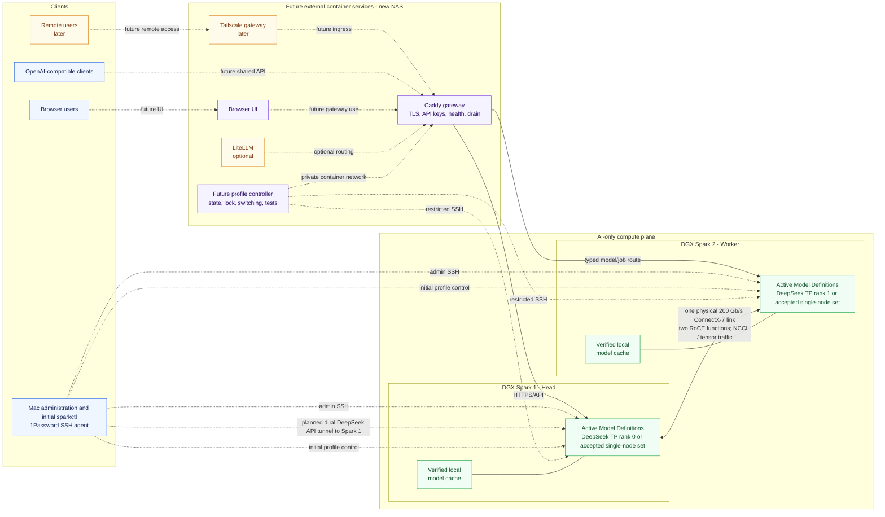
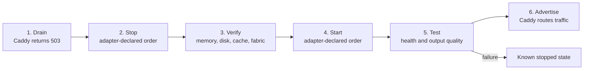

# Dual DGX Spark Architecture Overview

The platform separates AI compute from every surrounding service. Under an
accepted Cluster Profile, the two DGX Sparks run only its accepted Model
Definitions and required NVIDIA runtime adapters. Initial testing of an
accepted definition uses the developer-machine `sparkctl` controller and
loopback endpoints through SSH tunnels. No model runtime is accepted or
installed merely because it appears in this architecture. When the new NAS
arrives, gateway, profile control, user interface, remote access, and optional
routing services move there as containers.

## Hosts

| Host | Responsibility |
| --- | --- |
| Mac | Human administration through the 1Password-managed SSH key and initial `sparkctl` Cluster Profile control. It is not an always-on serving dependency. |
| Future new NAS or another external server | Later runs all non-AI containers: Caddy, the one-shot controller, browser UI, optional LiteLLM, and Tailscale ingress. |
| DGX Spark 1 | DeepSeek tensor-parallel rank 0 or the accepted Model Definition set assigned by the active Cluster Profile, plus complete verified caches for definitions eligible to run there. |
| DGX Spark 2 | DeepSeek tensor-parallel rank 1 or the accepted Model Definition set assigned by the active Cluster Profile, plus complete verified caches for definitions eligible to run there. |

## Services

| Service | What it does | Placement |
| --- | --- | --- |
| Caddy (future) | Will provide the stable HTTPS endpoint, private-CA TLS, bearer-key enforcement, health checks, drain mode, and fail-closed HTTP 503 responses after the external control host exists. It is not in the current inference path. | Future external control host |
| Profile controller | Runs one operation at a time, persists canonical Cluster Profile state, serializes switches with a PID/timestamp lock, controls both Sparks over restricted SSH, runs validation, and advertises only healthy profiles. | Developer machine initially; later one-shot external container |
| Browser UI | Provides chat and model selection while using only the Caddy endpoint. | External container |
| LiteLLM | Optionally adds model aliases, routing, quotas, or usage tracking when those features become useful. It is not required initially. | Optional external container |
| Tailscale gateway | Later exposes the named gateway service and restricted subnet access without placing remote-access software on the Sparks. | External host/container |
| Planned DeepSeek vLLM head | If accepted, the planned dual-Spark definition runs TP rank 0, scheduling, detokenization, and the upstream API here. The initial developer-machine SSH tunnel terminates at this API on Spark 1; future Caddy will consume the same definition-specific endpoint. | Spark 1 |
| Planned DeepSeek vLLM worker | If accepted, the planned dual-Spark definition runs TP rank 1 here and exchanges tensor data with rank 0 over the direct fabric. Spark 2 is not the API-serving endpoint for that definition. | Spark 2 |
| Runtime adapters | Implement the common lifecycle for official or audited model-specific loaders used by each immutable Model Definition. | One or both Sparks as declared by each Cluster Profile |
| Local model caches | Keep complete, manifest-verified snapshots on both nodes so the NAS and LAN are never in the model hot path. | Both Sparks |

## Traffic paths

- **Initial inference after acceptance:** the developer machine resolves
  accepted local endpoint metadata with `sparkctl endpoint`, opens an SSH
  tunnel, and reaches the definition's loopback endpoint through that tunnel.
  For the planned dual-Spark DeepSeek definition, Spark 1 is the API-serving
  head and the tunnel destination; Spark 2 remains its tensor-parallel worker.
  This placement is specific to that definition, not a generic ingress field
  or cluster-wide routing contract. Caddy and the NAS are not in this path.
- **Future shared inference:** client or UI → Caddy → the aliases advertised by the active Cluster Profile.
- **Control:** developer-machine controller initially, later external controller → restricted SSH commands on each Spark.
- **Administration:** Mac → each Spark through the 1Password SSH agent.
- **Tensor parallelism:** Spark 1 ↔ one direct 200 Gb/s ConnectX-7 physical
  link ↔ Spark 2 using both PCIe/RoCE functions. The accepted simultaneous
  aggregate is 185.14 Gb/s in each direction; the duplicated function link
  states are not independent 200 Gb/s links.
- **Model storage:** each Spark reads only its own verified local cache during serving.

## Model switching

For an accepted definition, the initial developer-machine controller behavior
is to withdraw and republish local endpoint metadata around stop, verify,
start, health, and quality gates. Clients reach a published loopback endpoint
only through an SSH tunnel. The following Caddy drain and route steps describe
the **future NAS gateway path**, not a current dependency:

After that future gateway is deployed, the NAS or other external service host
will be an availability dependency for shared client access, but it will never
carry model weights, KV-cache data, CUDA/JIT work, or tensor-parallel traffic.
It is not an availability dependency for the initial developer-machine SSH
tunnel path after a definition is accepted.

The [model and profile overview](model-profile-overview.md) visually maps each
Cluster Profile to both Sparks and its Model Definitions. The [model capacity
overview](model-capacity-overview.md) compares every official model with its
preferred Spark-optimized Model Definition and placement. Detailed loader
policy, placement classes, Cluster Profiles, and quality gates live in the
[multi-runtime model profile design](superpowers/specs/2026-08-02-multi-runtime-model-profiles-design.md).

The completed host, SSH, platform, fabric, and NCCL preparation is summarized
chronologically in the [installation record and lessons learned](installation-record.md).
