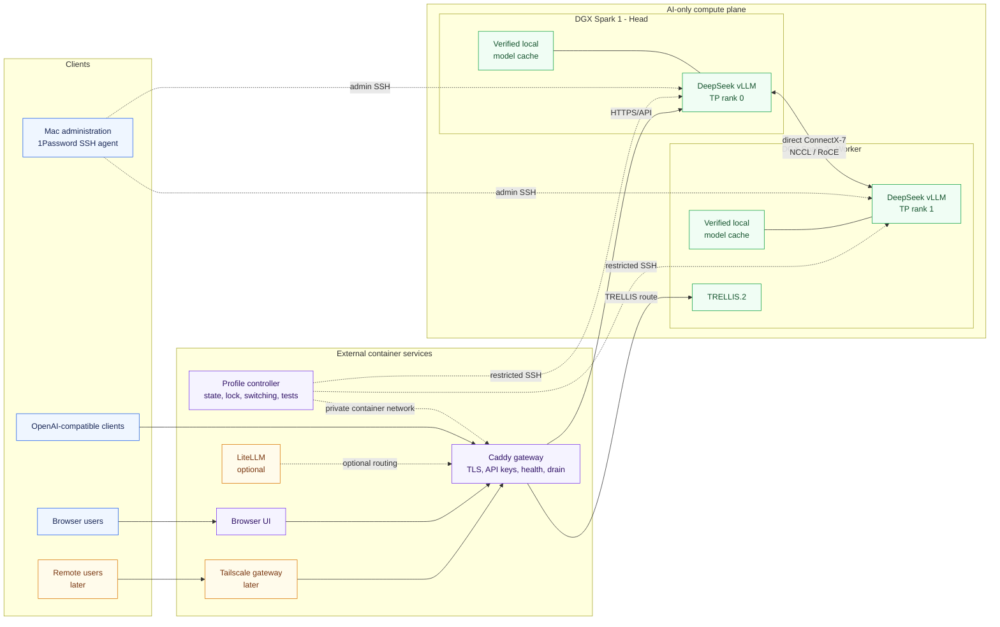
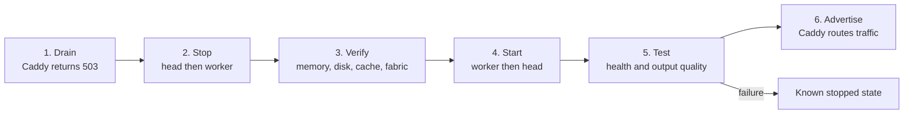

# Dual DGX Spark Architecture Overview

The platform separates AI compute from every surrounding service. The two DGX Sparks run model workloads and their required NVIDIA runtime only. Gateway, orchestration, user interface, remote access, and optional routing services run as containers on the DS218+ or another non-Spark host.

## Hosts

| Host | Responsibility |
| --- | --- |
| Mac | Human administration through the 1Password-managed SSH key. It is not an always-on platform dependency. |
| DS218+ or another external server | Runs all non-AI containers: Caddy, the one-shot controller, browser UI, optional LiteLLM, and later Tailscale ingress. |
| DGX Spark 1 | DeepSeek head, tensor-parallel rank 0, authenticated upstream API, and a complete local model cache. |
| DGX Spark 2 | DeepSeek worker, tensor-parallel rank 1, mutually exclusive TRELLIS.2 workload, and a complete local model cache. |

## Services

| Service | What it does | Placement |
| --- | --- | --- |
| Caddy | Provides the stable HTTPS endpoint, private-CA TLS, bearer-key enforcement, health checks, drain mode, and fail-closed HTTP 503 responses. | External control host |
| Profile controller | Runs one operation at a time, persists active-profile state, serializes switches with `flock`, controls both Sparks over restricted SSH, runs validation, and advertises only healthy profiles. | One-shot external container |
| Browser UI | Provides chat and model selection while using only the Caddy endpoint. | External container |
| LiteLLM | Optionally adds model aliases, routing, quotas, or usage tracking when those features become useful. It is not required initially. | Optional external container |
| Tailscale gateway | Later exposes the named gateway service and restricted subnet access without placing remote-access software on the Sparks. | External host/container |
| DeepSeek vLLM head | Runs TP rank 0, scheduling, detokenization, and the upstream API consumed by Caddy. | Spark 1 |
| DeepSeek vLLM worker | Runs TP rank 1 and exchanges tensor data with rank 0 over the direct fabric. | Spark 2 |
| TRELLIS.2 | Runs 3D generation when the two-node DeepSeek profile is stopped. | Spark 2 |
| Local model caches | Keep complete, manifest-verified snapshots on both nodes so the NAS and LAN are never in the model hot path. | Both Sparks |

## Traffic paths

- **Inference:** client or UI → Caddy → the currently advertised AI profile.
- **Control:** external controller → restricted SSH commands on each Spark.
- **Administration:** Mac → each Spark through the 1Password SSH agent.
- **Tensor parallelism:** Spark 1 ↔ direct ConnectX-7 ↔ Spark 2 using NCCL/RoCE.
- **Model storage:** each Spark reads only its own verified local cache during serving.

## Model switching

The NAS or other external service host is an availability dependency for client access, but it never carries model weights, KV-cache data, CUDA/JIT work, or tensor-parallel traffic.
