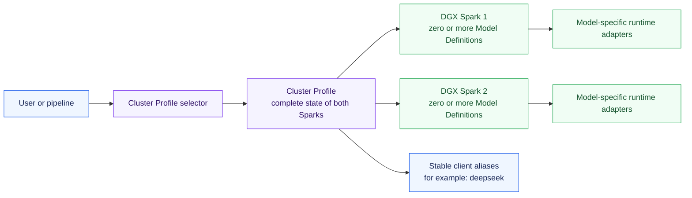
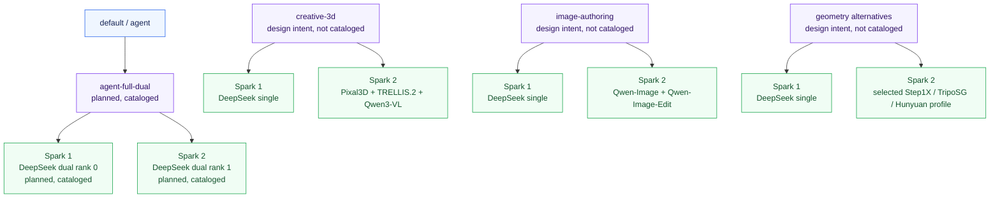
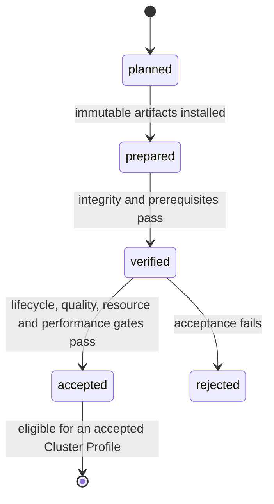

# DGX Spark Model and Profile Overview

This is the concise map of what a user selects, what runs on each DGX Spark,
and which optimized Model Definition is intended to back each capability. It
distinguishes checked-in catalog entries from design intent and runtime
acceptance: a listed row is not activatable until it is cataloged and every
referenced definition plus the exact combined placement has passed its
acceptance gates.

## Control model

- Users activate a **Cluster Profile**, never an arbitrary individual model.
- A Cluster Profile declares the complete simultaneous state of both nodes.
- A **Model Definition** is one immutable runnable variant: exact model,
  checkpoint, optimized loader, image or source build, commands, placement,
  resource envelope, and maturity record.
- Multiple Model Definitions are active together only after that exact N-way
  placement passes co-residency acceptance.
- `default` and `agent` resolve to the canonical `agent-full-dual` profile.
  They are convenience selectors, not separate profile IDs.
- Once an accepted profile publishes it, clients request the stable model name
  `deepseek`; the selected profile decides whether the dual- or single-Spark
  definition backs it.

## Profile map

| Cluster Profile intent | Spark 1 | Spark 2 | Stable aliases | State |
| --- | --- | --- | --- | --- |
| `agent-full-dual` (canonical default) | `deepseek-agent-dual` rank 0 | `deepseek-agent-dual` rank 1 | `deepseek` | Planned (cataloged); not activatable |
| `agent-long-dual` | `deepseek-long-dual` rank 0 | `deepseek-long-dual` rank 1 | `deepseek` | Design intent; not cataloged |
| `creative-3d` | `deepseek-agent-single` | `pixal3d-single`, `trellis2-4b-single`, `qwen3-vl-8b-single` | `deepseek`, creative model aliases | Design intent; not cataloged |
| `image-authoring` | `deepseek-agent-single` | `qwen-image-single`, `qwen-image-edit-2511-single` | `deepseek`, `qwen-image`, `qwen-image-edit` | Design intent; not cataloged |
| `rigging` | `deepseek-agent-single` | `tokenrig-single` plus evaluation definitions | `deepseek`, `tokenrig` | Design intent; not cataloged |
| `agent-nemotron-super` | `nemotron-super-single` | Idle | `nemotron-super` | Design intent; not cataloged |
| `agent-nemotron-nano-omni` | `nemotron-nano-omni-single` | Idle | `nemotron-nano-omni` | Design intent; not cataloged |
| `geometry-step1x` | `deepseek-agent-single` | `step1x-3d-single` | `deepseek`, `step1x-3d` | Design intent; not cataloged |
| `geometry-triposg` | `deepseek-agent-single` | `triposg-single` | `deepseek`, `triposg` | Design intent; not cataloged |
| `geometry-hunyuan3d-omni` | `deepseek-agent-single` | `hunyuan3d-omni-single` | `deepseek`, `hunyuan3d-omni` | Design intent; not cataloged |

“Planned (cataloged)” means a checked-in catalog entry exists, not that its
runtime is installed, accepted, or selectable. “Design intent” rows are visual
roadmap entries only: `sparkctl` cannot resolve or activate them. An accepted
profile needs accepted fingerprints for every referenced Model Definition plus
accepted evidence for the exact placement and combination.

## Model Definition map

| Type | Model Definition | Preferred DGX Spark path | Placement | State |
| --- | --- | --- | --- | --- |
| Default agent | `deepseek-agent-dual` | Mia/vLLM TP=2, 1M-capable candidate pinned to `b131b2a`, subject to acceptance | Both Sparks, exclusive | Planned (cataloged) |
| Long-context agent | `deepseek-long-dual` | Mia/vLLM long-context candidate with explicit concurrency limits | Both Sparks, exclusive | Design intent; not cataloged |
| Resident agent | `deepseek-agent-single` | DS4 Flash 0731 MXFP4 candidate, unaudited | One Spark, exclusive initially | Design intent; not cataloged |
| Alternative agent | `nemotron-super-single` | NVIDIA Nemotron 3 Super NVFP4 Spark candidate | One Spark, exclusive | Design intent; not cataloged |
| Multimodal agent | `nemotron-nano-omni-single` | NVIDIA Nano Omni NVFP4 Spark candidate | One Spark, co-residency candidate | Design intent; not cataloged |
| Image generation | `qwen-image-single` | ModelOpt NVFP4 candidate through a GB10-native SGLang Diffusion build | One Spark, exclusive initially | Design intent; not cataloged |
| Image editing | `qwen-image-edit-2511-single` | Nunchaku NVFP4 or ModelOpt candidate, subject to acceptance | One Spark, exclusive initially | Design intent; not cataloged |
| Image-to-3D | `pixal3d-single` | CUDA 13, ARM64, GB10 build candidate for Pixal3D | One Spark, exclusive initially | Design intent; not cataloged |
| Image-to-3D | `trellis2-4b-single` | TRELLIS.2 Spark build candidate | One Spark, exclusive initially | Design intent; not cataloged |
| Vision/evaluation | `qwen3-vl-8b-single` | GB10-native vLLM or SGLang service candidate | One Spark, co-residency candidate | Design intent; not cataloged |
| Rigging | `tokenrig-single` | FP16 or GB10-native TokenRig build candidate | One Spark, co-residency candidate | Design intent; not cataloged |
| Geometry/texture | `step1x-3d-single` | GB10-native sequential geometry and texture candidate | One Spark, exclusive initially | Design intent; not cataloged |
| Fast geometry | `triposg-single` | GB10-native official Diffusers candidate | One Spark, co-residency candidate | Design intent; not cataloged |
| Controllable 3D | `hunyuan3d-omni-single` | GB10-native official runtime candidate; FlashVDM remains subject to acceptance | One Spark, co-residency candidate | Design intent; not cataloged |

Each future optimized serving definition must retain an official generic
definition as a non-serving correctness oracle. A generic path does not become
user-selectable merely because it starts successfully.

## Current implementation state

| Layer | Current state |
| --- | --- |
| Hosts, SSH, platform, direct fabric | Accepted and recorded |
| Aggregate RDMA, latency, error counters, NCCL | Accepted and recorded |
| Model Definition and Cluster Profile schemas | Implemented |
| Framework catalog, admission, switching, CLI, and local state | Implemented |
| `deepseek-agent-dual` Model Definition | Planned (cataloged) at audited Mia commit `b131b2a`; its adapter, checkpoint manifest, and runtime are not installed or accepted |
| Canonical `agent-full-dual` profile | Planned (cataloged) with `default` and `agent` selectors; not activatable while its definition remains planned |
| Remaining Model Definitions and profiles | Design intent; configuration and acceptance evidence do not exist yet |
| Model activation | Blocked until the required runtime artifacts are installed and exact acceptance evidence exists |
| `sparkctl nodes status` | Implemented as concurrent, live, read-only health; no database or retained history |

## Maturity and activation

Only a cataloged definition enters this maturity flow, and only an `accepted`
definition fingerprint may satisfy profile admission. Changing a checkpoint,
image, source commit, command, resource envelope, or placement produces a new
fingerprint and invalidates old acceptance evidence.

## Sources of truth

- [Architecture overview](architecture-overview.md) — compute, control, access,
  and switching architecture.
- [Model capacity overview](model-capacity-overview.md) — official releases,
  optimized Spark paths, published fit evidence, and research status.
- [Multi-runtime model profile design](superpowers/specs/2026-08-02-multi-runtime-model-profiles-design.md)
  — normative definitions, loader rules, placement, admission, and acceptance.
- `config/workloads/` and `config/cluster-profiles/` — executable catalog;
  currently contains only `deepseek-agent-dual` and `agent-full-dual`.
- `inventory/reports/model-definitions.json` — current maturity fingerprints;
  today it records only `deepseek-agent-dual` as planned.
- `inventory/reports/accepted-cluster-profiles.json` — accepted exact-profile
  evidence; currently empty.
