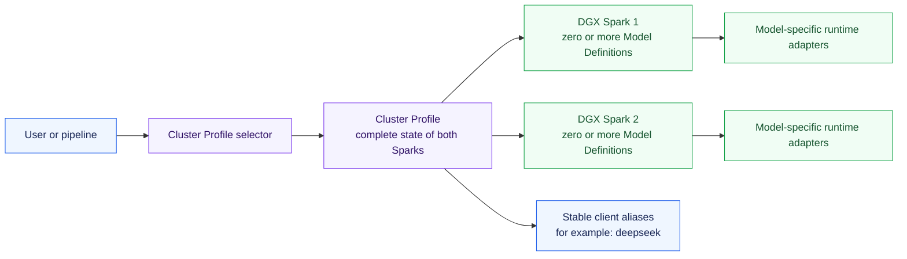
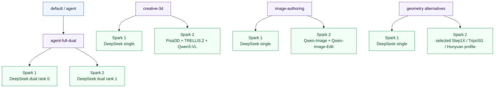
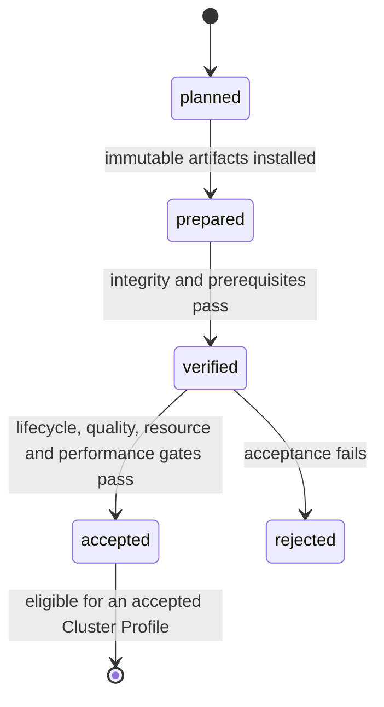

# DGX Spark Model and Profile Overview

This is the concise map of what a user selects, what runs on each DGX Spark,
and which optimized Model Definition backs each capability. It distinguishes
approved intent from runtime acceptance: a listed profile is not activatable
until every referenced definition and the exact combined placement have passed
their acceptance gates.

## Control model

- Users activate a **Cluster Profile**, never an arbitrary individual model.
- A Cluster Profile declares the complete simultaneous state of both nodes.
- A **Model Definition** is one immutable runnable variant: exact model,
  checkpoint, optimized loader, image or source build, commands, placement,
  resource envelope, and maturity record.
- Multiple Model Definitions are active together only after that exact N-way
  placement passes co-residency acceptance.
- `default` and `agent` resolve to the canonical `agent-full-dual` profile.
  They are convenience selectors, not separate profile IDs.
- Clients always request the stable model name `deepseek`; the selected profile
  decides whether the dual- or single-Spark definition backs it.

## Profile map

| Cluster Profile intent | Spark 1 | Spark 2 | Stable aliases | State |
| --- | --- | --- | --- | --- |
| `agent-full-dual` (canonical default) | `deepseek-agent-dual` rank 0 | `deepseek-agent-dual` rank 1 | `deepseek` | Planned; framework and runtime acceptance pending |
| `agent-long-dual` | `deepseek-long-dual` rank 0 | `deepseek-long-dual` rank 1 | `deepseek` | Planned |
| `creative-3d` | `deepseek-agent-single` | `pixal3d-single`, `trellis2-4b-single`, `qwen3-vl-8b-single` | `deepseek`, creative model aliases | Planned; exact four-definition placement must be accepted |
| `image-authoring` | `deepseek-agent-single` | `qwen-image-single`, `qwen-image-edit-2511-single` | `deepseek`, `qwen-image`, `qwen-image-edit` | Planned; exact three-definition placement must be accepted |
| `rigging` | `deepseek-agent-single` | `tokenrig-single` plus accepted evaluation definitions | `deepseek`, `tokenrig` | Planned |
| `agent-nemotron-super` | `nemotron-super-single` | Idle | `nemotron-super` | Planned |
| `agent-nemotron-nano-omni` | `nemotron-nano-omni-single` | Idle | `nemotron-nano-omni` | Planned |
| `geometry-step1x` | `deepseek-agent-single` | `step1x-3d-single` | `deepseek`, `step1x-3d` | Planned |
| `geometry-triposg` | `deepseek-agent-single` | `triposg-single` | `deepseek`, `triposg` | Planned |
| `geometry-hunyuan3d-omni` | `deepseek-agent-single` | `hunyuan3d-omni-single` | `deepseek`, `hunyuan3d-omni` | Planned |

“Planned” means cataloged intent, not installed or selectable. An accepted
profile has accepted fingerprints for every referenced Model Definition plus
accepted evidence for the exact placement and combination.

## Model Definition catalog

| Type | Model Definition | Preferred DGX Spark path | Placement | Initial maturity |
| --- | --- | --- | --- | --- |
| Default agent | `deepseek-agent-dual` | Audited Mia/vLLM TP=2 path with the accepted Spark-specific optimizations | Both Sparks, exclusive | Planned |
| Long-context agent | `deepseek-long-dual` | Controlled Mia/vLLM long-context variant with explicit concurrency limits | Both Sparks, exclusive | Planned |
| Resident agent | `deepseek-agent-single` | Audited DS4 quantized single-Spark service | One Spark, exclusive initially | Planned |
| Alternative agent | `nemotron-super-single` | NVIDIA Nemotron 3 Super NVFP4 Spark path | One Spark, exclusive | Planned |
| Multimodal agent | `nemotron-nano-omni-single` | NVIDIA Nano Omni NVFP4 Spark path | One Spark, co-residency candidate | Planned |
| Image generation | `qwen-image-single` | ModelOpt NVFP4 through a GB10-native SGLang Diffusion build | One Spark, exclusive initially | Planned |
| Image editing | `qwen-image-edit-2511-single` | Best accepted Nunchaku NVFP4 or ModelOpt optimized path | One Spark, exclusive initially | Planned |
| Image-to-3D | `pixal3d-single` | Audited CUDA 13, ARM64, GB10 build of Pixal3D | One Spark, exclusive initially | Planned |
| Image-to-3D | `trellis2-4b-single` | Audited TRELLIS.2 Spark build | One Spark, exclusive initially | Planned |
| Vision/evaluation | `qwen3-vl-8b-single` | GB10-native vLLM or SGLang service | One Spark, co-residency candidate | Planned |
| Rigging | `tokenrig-single` | Audited FP16 or GB10-native TokenRig build | One Spark, co-residency candidate | Planned |
| Geometry/texture | `step1x-3d-single` | GB10-native sequential geometry and texture pipeline | One Spark, exclusive initially | Planned |
| Fast geometry | `triposg-single` | GB10-native official Diffusers pipeline | One Spark, co-residency candidate | Planned |
| Controllable 3D | `hunyuan3d-omni-single` | GB10-native official runtime with accepted FlashVDM acceleration | One Spark, co-residency candidate | Planned |

Each optimized serving definition retains an official generic definition as a
non-serving correctness oracle. A generic path does not become user-selectable
merely because it starts successfully.

## Current implementation state

| Layer | Current state |
| --- | --- |
| Hosts, SSH, platform, direct fabric | Accepted and recorded |
| Aggregate RDMA, latency, error counters, NCCL | Accepted and recorded |
| Model Definition and Cluster Profile schemas | Implemented |
| `deepseek-agent-dual` configuration | Scaffolded, but its adapter, local manifest, and runtime acceptance are not installed yet |
| Canonical `agent-full-dual` profile | Implemented as the canonical planned profile; `default` and `agent` are selectors |
| Remaining Model Definitions and profiles | Planned; configuration and acceptance evidence not created yet |
| `sparkctl` catalog, admission, switching, and local state | Implemented; model activation remains blocked until runtime acceptance evidence exists |
| `sparkctl nodes status` | Implemented as concurrent, live, read-only health; no database or retained history |

## Maturity and activation

Only an `accepted` definition fingerprint may satisfy profile admission.
Changing a checkpoint, image, source commit, command, resource envelope, or
placement produces a new fingerprint and invalidates old acceptance evidence.

## Sources of truth

- [Architecture overview](architecture-overview.md) — compute, control, access,
  and switching architecture.
- [Model capacity overview](model-capacity-overview.md) — official releases,
  optimized Spark paths, published fit evidence, and research status.
- [Multi-runtime model profile design](superpowers/specs/2026-08-02-multi-runtime-model-profiles-design.md)
  — normative definitions, loader rules, placement, admission, and acceptance.
- `config/workloads/` and `config/cluster-profiles/` — executable catalog once
  each artifact is reconciled with the normative design.
- `inventory/reports/model-definitions.json` and
  `inventory/reports/accepted-cluster-profiles.json` — maturity and accepted
  evidence once produced.
