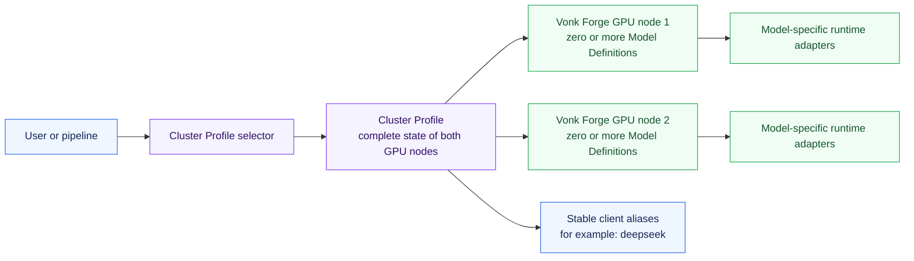
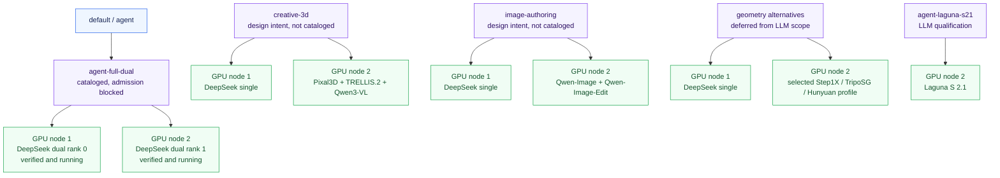
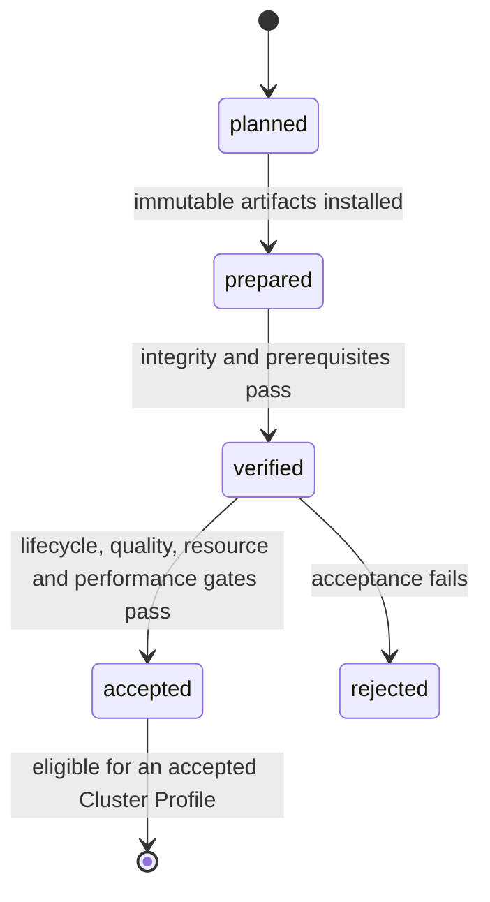

# Vonk Forge GPU node Model and Profile Overview

This is the concise map of what a user selects, what runs on each Vonk Forge GPU node,
and which optimized Model Definition is intended to back each capability. It
distinguishes checked-in catalog entries from design intent and runtime
acceptance: a listed row is not activatable until it is cataloged and every
referenced definition plus the exact combined placement has passed its
acceptance gates.

## Control model

- Users activate a **Cluster Profile**, never an arbitrary individual model.
- A Cluster Profile declares the complete simultaneous state of both nodes.
- A **Model Definition** is one immutable runnable variant: exact model,
  checkpoint, optimized loader, image or source build, commands, placement,
  resource envelope, and maturity record.
- Multiple Model Definitions are active together only after that exact N-way
  placement passes co-residency acceptance.
- `default` and `agent` resolve to the canonical `agent-full-dual` profile.
  They are convenience selectors, not separate profile IDs.
- Once an accepted profile publishes it, clients request the stable model name
  `deepseek`; the selected profile decides whether the dual- or single-GPU node
  definition backs it.

## Profile map

| Cluster Profile intent | GPU node 1 | GPU node 2 | Stable aliases | State |
| --- | --- | --- | --- | --- |
| `agent-full-dual` (canonical default) | `deepseek-agent-dual` rank 0 | `deepseek-agent-dual` rank 1 | `deepseek` | Runtime operational and definition verified; profile admission waits for final acceptance |
| `agent-long-dual` | `deepseek-long-dual` rank 0 | `deepseek-long-dual` rank 1 | `deepseek` | Design intent; not cataloged |
| `creative-3d` | `deepseek-agent-single` | `pixal3d-single`, `trellis2-4b-single`, `qwen3-vl-8b-single` | `deepseek`, creative model aliases | Design intent; not cataloged |
| `image-authoring` | `deepseek-agent-single` | `qwen-image-single`, `qwen-image-edit-2511-single` | `deepseek`, `qwen-image`, `qwen-image-edit` | Design intent; not cataloged |
| `rigging` | `deepseek-agent-single` | `tokenrig-single` plus evaluation definitions | `deepseek`, `tokenrig` | TokenRig isolated boundary; planned pending Blender >=4.2 |
| `agent-nemotron-super` | `nemotron-super-single` | Idle | `nemotron-super` | Design intent; not cataloged |
| `agent-nemotron-nano-omni` | `nemotron-nano-omni-single` | Idle | `nemotron-nano-omni` | Design intent; not cataloged |
| `agent-laguna-s21` | Idle | `laguna-s21-single` | `laguna-s21` | Cataloged planned LLM; qualification pending |
| `geometry-step1x` | `deepseek-agent-single` | `step1x-3d-single` | `deepseek`, `step1x-3d` | Design intent; not cataloged |
| `geometry-triposg` | `deepseek-agent-single` | `triposg-single` | `deepseek`, `triposg` | TripoSG verified on GPU node 2; acceptance pending |
| `geometry-hunyuan3d-omni` | `deepseek-agent-single` | `hunyuan3d-omni-single` | `deepseek`, `hunyuan3d-omni` | Design intent; not cataloged |

“Verified” means the immutable artifacts and every definition-required node prerequisite passed;
it does not imply final acceptance or `vonkctl` admission. “Design intent” rows are visual
roadmap entries only: `vonkctl` cannot resolve or activate them. An accepted
profile needs accepted fingerprints for every referenced Model Definition plus
accepted evidence for the exact placement and combination.

## Model Definition map

| Type | Model Definition | Preferred Vonk Forge GPU node path | Placement | State |
| --- | --- | --- | --- | --- |
| Default agent | `deepseek-agent-dual` | Mia/vLLM TP=2, 1M-capable runtime pinned to `b131b2a` | Both GPU nodes, exclusive | Verified and operational; final acceptance deferred |
| Long-context agent | `deepseek-long-dual` | Mia/vLLM long-context candidate with explicit concurrency limits | Both GPU nodes, exclusive | Design intent; not cataloged |
| Resident agent | `deepseek-agent-single` | Audited DS4 v0.5.3 Q2-imatrix + DSpark GGUF pair | One GPU node, exclusive initially | Verified and operational; final acceptance and profile admission deferred |
| DS4 branch alternative | `deepseek-agent-single` release variant | `bleysg` DSpark work when merged into the Entrpi DS4 branch | One GPU node, exclusive initially | Same model identity; merged release requires a new fingerprint and full requalification |
| Alternative agent | `nemotron-super-single` | NVIDIA Nemotron 3 Super NVFP4 GPU node candidate | One GPU node, exclusive | Design intent; not cataloged |
| Multimodal agent | `nemotron-nano-omni-single` | NVIDIA Nano Omni NVFP4 GPU node candidate | One GPU node, co-residency candidate | Design intent; not cataloged |
| Agentic coding LLM | `laguna-s21-single` | Official Laguna S 2.1 NVFP4 candidate through its model-owned runtime | One GPU node, exclusive initially | Planned; qualification pending |
| Image generation | `qwen-image-single` | ModelOpt NVFP4 candidate through a GB10-native SGLang Diffusion build | One GPU node, exclusive initially | Design intent; not cataloged |
| Image editing | `qwen-image-edit-2511-single` | Nunchaku NVFP4 or ModelOpt candidate, subject to acceptance | One GPU node, exclusive initially | Design intent; not cataloged |
| Image-to-3D | `pixal3d-single` | CUDA 13, ARM64, GB10 build candidate for Pixal3D | One GPU node, exclusive initially | Design intent; not cataloged |
| Image-to-3D | `trellis2-4b-single` | TRELLIS.2 GPU node build candidate | One GPU node, exclusive initially | Design intent; not cataloged |
| Vision/evaluation | `qwen3-vl-8b-single` | GB10-native vLLM or SGLang service candidate | One GPU node, co-residency candidate | Design intent; not cataloged |
| Rigging | `tokenrig-single` | Isolated official TokenRig boundary; Blender prerequisite pending | One GPU node, co-residency candidate | Planned; prerequisite gate recorded |
| Geometry/texture | `step1x-3d-single` | GB10-native sequential geometry and texture candidate | One GPU node, exclusive initially | Design intent; not cataloged |
| Fast geometry | `triposg-single` | GB10-native official Diffusers runtime | One GPU node, co-residency candidate | Verified on GPU node 2; acceptance pending |
| Controllable 3D | `hunyuan3d-omni-single` | GB10-native official runtime candidate; FlashVDM remains subject to acceptance | One GPU node, co-residency candidate | Design intent; not cataloged |

Each future optimized serving definition must retain an official generic
definition as a non-serving correctness oracle. A generic path does not become
user-selectable merely because it starts successfully.

## Current implementation state

| Layer | Current state |
| --- | --- |
| Hosts, SSH, platform, direct fabric | Accepted and recorded |
| Aggregate RDMA, latency, error counters, NCCL | Accepted and recorded |
| Model Definition and Cluster Profile schemas | Implemented |
| Framework catalog, admission, switching, CLI, and local state | Implemented |
| `deepseek-agent-dual` Model Definition | Immutable Mia release `92f5…0575e` is installed on both nodes, structurally verified, healthy, and passes all 11 live quality gates; final performance, thermal, lifecycle and reboot acceptance is deferred |
| `deepseek-agent-single` Model Definition | Immutable DS4 release `ca69…82b2` is installed on GPU node 1, verified at 32,768 context, and passes all 12 live quality and cache gates; final performance, thermal, lifecycle, reboot and exact-profile acceptance is deferred |
| `qwen3-vl-8b-single` Model Definition | Immutable Qwen3-VL release is prepared and verified on GPU node 2 with model-owned venv/cache, healthy OpenAI-compatible API, structured vision output, and three cold-start/inference/stop cycles; reboot, extended thermal/capacity, and exact-profile acceptance remain deferred |
| `laguna-s21-single` Model Definition | Cataloged planned Laguna S 2.1 NVFP4 candidate with its own adapter directory, scratch/venv root, snapshot, output, and endpoint namespace; no serving release exists yet |
| `triposg-single` Model Definition | Immutable TripoSG release `925d…7469` is prepared and verified on GPU node 2 with an isolated Python 3.12 runtime, pinned checkpoints, healthy API, watertight GLB output, and three lifecycle cycles; creative qualification is deferred from the active LLM pass |
| Canonical `agent-full-dual` profile | Cataloged with `default` and `agent` selectors; not admitted while its definition remains verified rather than accepted |
| Remaining Model Definitions and profiles | Design intent; configuration and acceptance evidence do not exist yet |
| Model activation | The verified runtime is currently running through the direct adapter; `vonkctl` activation remains blocked until exact acceptance evidence exists |
| `vonkctl nodes status` | Implemented as concurrent, live, read-only health; no database or retained history |

## Legacy workload-package projection

The existing `deepseek-agent-dual` and `deepseek-agent-single` public workload
IDs remain read-only compatibility projections. Their pinned Mia and DS4
definitions resolve to the generic package family, immutable release lock, and
deployment documents under `config/package-families/`,
`manifests/workload-releases/`, and `config/workload-deployments/`. Package
operations do not contain family or model-name branches; another family can be
added through the same documents without a `vonk-forge` platform update.

The DS4 generic release lock uses the SHA-256 of the checked-in DS4 checkpoint
manifest (`…df5b…`), while the legacy profile/evidence retains its historical
malformed 63-character `…dfb…` string. This corrects no acceptance evidence and
does not change the legacy definition fingerprint; it is a migration-boundary
integrity correction that must be reconciled during any future DS4
requalification.

## Maturity and activation

Only a cataloged definition enters this maturity flow, and only an `accepted`
definition fingerprint may satisfy profile admission. Changing a checkpoint,
image, source commit, command, resource envelope, or placement produces a new
fingerprint and invalidates old acceptance evidence.

## Sources of truth

- [Architecture overview](architecture-overview.md) — compute, control, access,
  and switching architecture.
- [Model capacity overview](model-capacity-overview.md) — official releases,
  optimized GPU node paths, published fit evidence, and research status.
- [Multi-runtime model profile design](superpowers/specs/2026-08-02-multi-runtime-model-profiles-design.md)
  — normative definitions, loader rules, placement, admission, and acceptance.
- `config/workloads/` and `config/cluster-profiles/` — executable catalog;
  currently contains both DeepSeek Model Definitions and the cataloged
  `agent-full-dual` and `agent-single` profiles.
- `inventory/reports/model-definitions.json` — current maturity fingerprints;
  today it records both DeepSeek definitions as verified.
- `inventory/reports/accepted-cluster-profiles.json` — accepted exact-profile
  evidence; currently empty.
